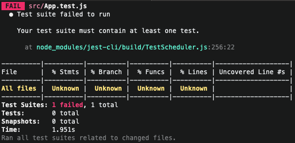

## Unit-testing-of-the-first-component-1-2

Let's give:

```bash
npm run test
```

to run the jest test environment and with **`react-test-renderer`` we will mount the component in the test environment to check its output**.
let's mount the component in the test environment to check its output\*\*.

We are going to see all its methods that is an object in which come all the methods
that we can use

console.log src/App.test.js:10
{
\_Scheduler: {
reset: [Function: reset],
unstable_IdlePriority: 5,
unstable_ImmediatePriority: 1,
unstable_LowPriority: 4,
unstable_NormalPriority: 3,
unstable_Profiling: null,
unstable_UserBlockingPriority: 2,
unstable_advanceTime: [Function: unstable_advanceTime],
unstable_cancelCallback: [Function: unstable_cancelCallback],
unstable_clearYields: [Function: unstable_clearYields],
unstable_continueExecution: [Function: unstable_continueExecution],
unstable_flushAll: [Function: unstable_flushAll],
unstable_flushAllWithoutAsserting: [Function: unstable_flushAllWithoutAsserting],
unstable_flushExpired: [Function: unstable_flushExpired],
unstable_flushNumberOfYields: [Function: unstable_flushNumberOfYields],
unstable_flushUntilNextPaint: [Function: unstable_flushUntilNextPaint],
unstable_forceFrameRate: [Function: forceFrameRate],
unstable_getCurrentPriorityLevel: [Function: unstable_getCurrentPriorityLevel],
unstable_getFirstCallbackNode: [Function: unstable_getFirstCallbackNode],
unstable_next: [Function: unstable_next],
unstable_now: [Function: getCurrentTime],
unstable_pauseExecution: [Function: unstable_pauseExecution],
unstable_requestPaint: [Function: requestPaint],
unstable_runWithPriority: [Function: unstable_runWithPriority],
unstable_scheduleCallback: [Function: unstable_scheduleCallback],
unstable_setDisableYieldValue: [Function: setDisableYieldValue],
unstable_shouldYield: [Function: shouldYieldToHost],
unstable_wrapCallback: [Function: unstable_wrapCallback],
unstable_yieldValue: [Function: unstable_yieldValue], unstable_yieldValue: [Function: unstable_yieldValue]
},
root: [Getter],
toJSON: [Function: toJSON],
toTree: [Function: toTree],
PASS src/App.test.jsn: update],
<App />
✓ render correctly (31ms).

----------|----------|----------|----------|----------|-------------------|
File | % Stmts | % Branch | % Branch | % Funcs | % Lines | Uncovered Line #s |
----------|----------|----------|----------|----------|-------------------|
All files | Unknown | Unknown | Unknown | Unknown | Unknown | Unknown | Unknown |
----------|----------|----------|----------|----------|-------------------|
Test Suites: 1 passed, 1 total
Tests: 1 passed, 1 total
Snapshots: 0 total
Time: 6.186s
Ran all test suites related to changed files.

unstable_flushSync -> what we can get is the instance of the component

when you access root you are accessing the instance, so this is the instance.
instance, we can search through the selectors for the instance of that component is
so we are going to do the following


component.root.findByType(); -> is a method that allows us to search by type
component in this case receives an argument, the argument is an html tag in this case.
I am going to look for a header inside the component tree

we are going to corroborate that this defined

  <App />
    ✓ render correctly (17ms).
    ✓ Render header correct (4ms)

--------------------|----------|----------|----------|----------|-------------------|
File | % Stmts | % Branch | % Branch | % Funcs | % Lines | Uncovered Line #s |
--------------------|----------|----------|----------|----------|-------------------|
All files | 11.76 | 0 | 25 | 12.5 | | |
App.js | 100 | 100 | 100 | 100 | 100 | 100 | 100 | 100 | 100 | 100 | 100
index.js | 0 | 100 | 100 | 100 | 0 | 1,2,3,4,6,7 | |
reportWebVitals.js | 0 | 0 | 0 | 0 | 0 | 1,2,3,4,5,6,7,8 | 100 | 100 | 100 | 100 | 100 | 100 | 100 | 100 | 100 | 100 | 100 | 100 | 100 | 100 | 100 | 100 | 100 | 100
setupTests.js | 100 | 100 | 100 | 100 | 100 | 100 | 100 | 100 | 100 | 100 | 100 | 100 | 100
--------------------|----------|----------|----------|----------|-------------------|
Test Suites: 1 passed, 1 total
Tests: 2 passed, 2 total
Snapshots: 0 total
Time: 4.629s
Ran all test suites.

we have 100% coverage, it is very easy to reach 100% on components that do not have as much
that do not have so much logic

```js
it("Render header correct", () => {
  const component = create(<App />);
  const header = component.root.findByType("header");
  expect(header).toBeDefined();
});
```

The reason for this is because I have to make another matcher.

Let's now check the props className of the header:

Let's look at our third test:

when a test fails we can see a place where the error occurs in the
console.



we run the test and see that our 3 tests pass.

<App />
    ✓ render correctly (18ms).
    ✓ Render header correct (3ms)
    ✓ Render a text, link and image (6ms)

```js
 it("Render a text, link and image", () => {
    const component = create(<App />);
    const header = component.root.findByType("header");

    const img = header.findByType("img");
    const a = header.findByType("a");
    const p = header.findByType("p");

    expect(img).toBeDefined();
    expect(img.props.className).toEqual("App-logo");
    expect(img.props.src).toEqual("logo
```
