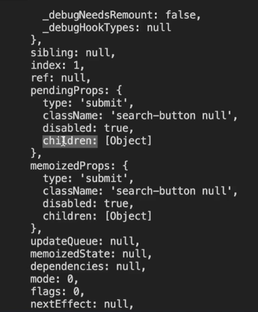

# Button test case

let's check the component:

```js
const Form = ({ handleSubmit, history }) => {
  const [searchEntry, setSearchEntry] = useState("");
  // update search text state
  const updateSearchInput = (e) => {
    setSearchEntry(e.target.value);
  };
  return (
    <form
      className="search-form"
      onSubmit={(e) => handleSubmit(e, history, searchEntry)}
    >
      <input
        type="text"
        name="search"
        placeholder="Search..."
        onChange={updateSearchInput}
        value={searchEntry}
      />
      <button
        type="submit"
        className={`search-button ${searchEntry.trim() ? "active" : null}`}
        disabled={!searchEntry.trim()}
      >
        <svg height="32" width="32">
          <path
            d="M19.427 21.427a8.5 8.5 0 1 1 2-2l5.585 5.585c.55.55.546 1.43 0 1.976l-.024.024a1.399 1.399 0 0 1-1.976 0l-5.585-5.585zM14.5 21a6.5 6.5 0 1 0 0-13 6.5 6.5 0 0 0 0 13z"
            fill="#ffffff"
            fillRule="evenodd"
          />
        </svg>
      </button>
    </form>
  );
};

export default Form;
```

What I am seeing is that it has logic, some of that is what we are going to try to show,
that it is not shown, that it is unblocked or blocked. Inside button it comes the property disable and this
property disable varies quite a lot. What it means is that if the searchEntry change
this property is enabled after being trimmed without spaces, then the button is going to be enabled.
enabled, this is a test case to test



here what we can verify if disable is true.

so we can access inside the instance of button.props.disable directly
to the property of that component, which we expect to be .toBeTruthy()

We create another test that has to be equal to:
**expect(button.props.disable).toEqual("search-button null");**

if it is empty in a first instance it will be null, otherwise it will be
active

Translated with www.DeepL.com/Translator (free version)

```js
className={`search-button ${searchEntry.trim() ? "active" : null}`}
```
