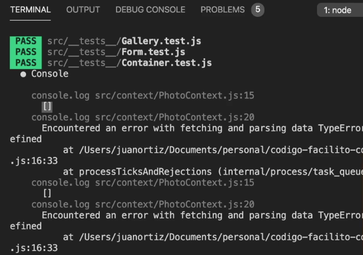

# Checking results of mock API calls



You are not actually making an API call, but what you are implementing
that inside the mocking we have here

```js
// eslint-disable-next-line import/no-anonymous-default-export
export default {
  get: jest.fn().mockImplementation(() => Promise.resolve([])),
  post: jest.fn().mockImplementation(() => Promise.reject("")),
  put: jest.fn(),
};
```

we have the get and it is returning an empty array, what happens if we return the information that has to be:

we are going to read the information manually, knowing our component, knowing the information that we handle, it is going to be very simple, let's see:

Inside response we have to have data, photos and then photo.

If we assemble the object in a first instance

```js
import React, { createContext, useState } from "react";
import axios from "axios";
import { apiKey } from "../api/config";
export const PhotoContext = createContext();

const PhotoContextProvider = (props) => {
  const [images, setImages] = useState([]);
  const [loading, setLoading] = useState(true);
  const runSearch = (query) => {
    axios
      .get(
        `https://api.flickr.com/services/rest/?method=flickr.photos.search&api_key=${apiKey}&tags=${query}&per_page=24&format=json&nojsoncallback=1`
      )
      .then((response) => {
        console.log(response);
        setImages(response.data.photos.photo);
        setLoading(false);
      })
      .catch((error) => {
        console.log(
          "Encountered an error with fetching and parsing data",
          error
        );
      });
  };
  return (
    <PhotoContext.Provider value={{ images, loading, runSearch }}>
      {props.children}
    </PhotoContext.Provider>
  );
};

export default PhotoContextProvider;
```

This would be the structure.

```js
{data: {
photos: {
photo: [],
}
}}
```

let's go to Container.test and if it is indeed necessary to put this update inside act()
there are libraries that have it by default

```js
it("Lama a la API si es necesario o cambia el texto", async () => {
  await act(async () => {
    await component.update(
      <PhotoContextProvider>
        <Container searchTerm="text" />
      </PhotoContextProvider>
    );
  });
});
```

all the component the update I am going to place it in a callback of the act -> the callback
is the update of the component that is asynchronous. We still have a lot of errors even though we are using act this is not working and that is because there are several updates that are happening while the component is being assembled and we have not noticed or we are not really caching it, that is why when the component
component is mounted we have to go right up here to the beforeEach to also do the same thing, because now that the API call is already happening, that is to say it is already updating, then we have to place it inside act, this callback is going to be asynchronous because of the work that is going to happen inside it.
that is going to happen inside.

As it is double asynchronous work I am going to write to act() the same as await, because there are many updates inside our component and we have to wait for it otherwise this will not work.

```js
beforeEach(async () => {
  await act(async () => {
    component = await create(
      <PhotoContextProvider>
        <Container searchTerm="" />
      </PhotoContextProvider>
    );
  });
});
```

```js
expect(component.root.findAllByType(Loader));
```

We have a test case failing, this test case tells us that it has not found the loader, the reason is because the loader no longer exists, it has already loaded the information, it will be difficult to test, because when the component is displayed it immediately changes the loader and hides it, then this test case is no longer valid, but gallery if it exists, then this test case is no longer valid.

But now gallery does exist

```js
expect(component.root.findAllByType(Gallery).length.toEqual(0));
```

it is already showing then we change the toEqual to 1
There you have passed all the test cases, at least for this component.
Container.test.js
We already have what we need, we already call the API in case it is necessary, once this is updated.
this is updated:

```js
beforeEach(async () => {
  await act(async () => {
    component = await create(
      <PhotoContextProvider>
        <Container searchTerm="" />
      </PhotoContextProvider>
    );
  });
});
```

that when it is called again to the API it shows us information, then we are going again
to axios and we saw mockImplementation() -> we are going to do it 2 times to say that when it is called again it does another thing to me, if this works I want to do a mocking of axio, I go again to my Container.test.js and I really want to modify the information
that is going to come back to me before another call is made so what I am going to do here is the following -> I am going to import axios

```js
axios.get.mockImplementatio();
```

it is supposed to be already a jest constructor, I am going to copy an element of the data of the test
galerry I am going to copy only an element to me and it is going to be the content that is going to have
photo, then what we are doing here is the mocking of this implementation.

```js
it("Lama a la API si es necesario o cambia el texto", async () => {
  axios.get.mockImplementatio(() =>
    Promise.resolve({
      data: {
        photos: {
          photo: [
            {
              farm: "farmTest01",
              server: "serverTest",
              id: "testId01",
              secret: "1223423eas",
              title: "titleTest01",
            },
          ],
        },
      },
    })
  );

  await act(async () => {
    await component.update(
      <PhotoContextProvider>
        <Container searchTerm="text" />
      </PhotoContextProvider>
    );
  });
});
```

Since what we saw previously jest.get is a mocking function, we can make another
Implementation and now we would have to display information that comes inside photo.

then with times it has to be called during the first assembly, call the API if necessary or change the text, this is number 2 and then in component update it is 3
that is at the end

```js
expect(axios.get).toHaveBeenCalled();
expect(axios.get).toHaveBeenCalledTimes(3);
expect(axios.put).not.toHaveBeenCalled();
expect(axios.put).not.toHaveBeenCalled();
```

we did this implementation to corroborate if the data is really arriving.

Once the component has been updated we are going to update by type

```js
it("Lama a la API si es necesario o cambia el texto", async () => {
  const customData = {
    data: {
      photos: {
        photo: [
          {
            farm: "farmTest01",
            server: "serverTest",
            id: "testId01",
            secret: "1223423eas",
            title: "titleTest01",
          },
        ],
      },
    },
  };

  axios.get.mockImplementatio(() => Promise.resolve(customData));

  await act(async () => {
    await component.update(
      <PhotoContextProvider>
        <Container searchTerm="text" />
      </PhotoContextProvider>
    );
  });

  expect(axios.get).toHaveBeenCalled();
  expect(axios.get).toHaveBeenCalledTimes(3);
  expect(axios.post).not.toHaveBeenCalled();
  expect(axios.put).not.toHaveBeenCalled();
  expect(component.root.findAllByType(Gallery).props.data).toEqual(
    customData.data.photos.photo
  );
});
```

let's remember that to PhotoContext that data we take photos and another arrangement that is photo, that is photo, that is photo in fact we have an arrangement and nothing more, it is good to verify the calls to The calls to the API that are third party services and good to see that if my component performs well the functions that should do
