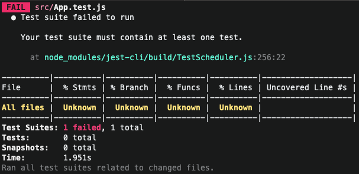

# Structure of a unit test

Nuestro archivo App.test.js lo vamos a comenzar de 0 así que borramos
su contenido. Ya que esta predefinida con testing library de momento
vamos a utilizar **react test render**

Vamos a importar:

```js
import { render } from "react-test-render";
```

viene empaquetado dentro de create react app, no se ve dentro del package.json
pero si revisamos en la app vamos a ver ese paquete por ahí

```bash
npm run test
```

Instalar importante

```bash
yarn add --dev react-test-renderer.
```

lo que viene basicamente es el coverage, que ya mostramos en el video anterior, ademas
de toda esas opciones que podemos colocar, estamos en modo watch

a lo que nos referimos es que si aplico un cambio dentro de mi archivo, las pruebas
se van ejecutar solas por si mismo de nuevamente,

ahora nos va marcar un error



si tu archivo de prueba no contiene ninguna prueba unitaria o ningún caso
de prueba va marcar un error, que es el que estamos marcando aqui.

Cada archivo o cada test file debe tener al menos una prueba unitaria, un archivo
vacío nos va marcar un error, entonces para evitar el error, hay que escribir la estructura de una
prueba unitaria con sus respectivos casos de prueba.

Esta prueba unitaria la vamos a definir con la es estructura de describe() al
igual expect() funciona de la misma manera esta inyectado de manera global por el test
runer que es jest no es necesario importarlo de algún otro lugar.

Esta es un función que recibe 2 argumentos:

- primer argumento es un string como vamos a escribir nuestra prueba unitaria, buena
  práctica es llamarla con el nombre del componente, ya sea que lo describas o ya sea
  que coloques el tag del componente
- como segundo argumento recibe un callback, que es una función que puede ser una función
  tradicional o puede ser un arrow function

por lo tanto un decribe puede tener pruebas o casos de pruebas, vamos a utilizar
un arrow function para tener todos los casos de prueba.

```js
describe("<App />", () => {});
```

si yo guardo me va seguir marcando el error, este es la estructura base de una prueba
unitaria.

El primer caso de prueba que podemos hacer es que se monte o se renderice
correctamente el componente

## it();

El primer argumento es un string, el segundo argumento es una función
flecha

```js
it("", () => {});
```

justo dentro va pasar todo el trabajo de todos los expect y todas las validaciones
que tenemos que hacer con sus respectivos matcher para validar si en realidad
se esta ejecutando correctamente

```bash

  <App />
    ✓ renderizar correctamente (2ms)

----------|----------|----------|----------|----------|-------------------|
File      |  % Stmts | % Branch |  % Funcs |  % Lines | Uncovered Line #s |
----------|----------|----------|----------|----------|-------------------|
All files |  Unknown |  Unknown |  Unknown |  Unknown |                   |
----------|----------|----------|----------|----------|-------------------|
Test Suites: 1 passed, 1 total
Tests:       1 passed, 1 total
Snapshots:   0 total
Time:        1.612s
```

acá tenemos que la prueba ha pasado, pero no tenemos ningún caso de prueba valido,
esta pasando pero vamos notar que el caso de prueba aún no esta cubriendo con alguna cosas,
% Stmts 0 tadavía no tenemos níngun estament que se este ejecutando

pero ya tenemos el cuerpo de una prueba unitaria

```js
describe("<App />", () => {
  it("renderizar correctamente", () => {});
});
```

hay que familiarizarse con el no memorizarlo pero si saber que hace cada cosa, dentro
de describe tenemos un callback que va tener todos los casos de prueba, que podemos tener 1
hasta ene casos de pruebas. **Este es punto de partida la primera prueba es que se monte
o se renderice correctamente.**

La diferencia es que el el metodo render es create dentro de react test render,
luego debemos de importar nuestro componente. Después vamos a poner el componente como su lo estuviesemos llamando
dentro de otro componente padre, lo que va hacer es que me va montar el componente padre,
pero como lo puedes ver simplemente lo esta montando lo esta ejecutando. Pero sin embargo
no estamos utilizando expect(); de nada, de hecho ya cambio el stament cambio a un 100%
todo el reporte de covertura o coverage, lo cual es bastante agradable, pero sin embargo
aún no sabemos que es lo que por aquí sucede

```js
expect(component).toBeDefine();
```

toBeDefine(); -> no necesita de ningún parametro o argumento para funcionar
