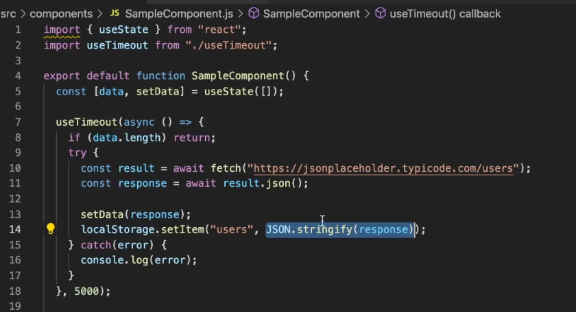
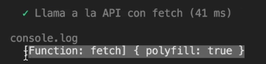

# Knowing fetch and localStorage component

works something similar but there is another section completely separate, if we use npx or cra
you have to manually install react-test-renderer, by default it comes installed with testing library
testing library works somewhat similar but you have to see another section completely apart



The information in this component is being stored as a string because
I can't directly save objects in the browser storage, I can save it in string form and that is why
string form and that's why I'm making the object to be converted to string and when I want to use it, I decode it
when I want to use it I decode it again or I reverse it to be an object

Jest useFakeTimers

let's apply

```bash
npm run test src/components
```

To give me the component coverage.

Let's create our SampleComponent.tets.js test.

```js
import create from "react-test-renderer";

import SampleComponent from "./SampleComponent";

let component;

describe("<SampleComponent>", () => {
  before(() => {
    jest.useFakeTimers();
    component = create(<SampleComponent />);
  });

  it("Render correctly", () => {
    expect(component.root).toBedefined();
    expect(component.root).findByType("h4").toBeDefined();
  });

  it("Call the API with fetch", () => {
    console.log(window.fetch);
  });
});
```

the component is rendered correctly and first of all I want to see if actually
has been executed by here an API call also if they have actually executed the timers, then we have more test cases, the interesting thing is that we are using a Timeout, our next step is to use jest.useFaketimers(;;).
next step is to use jest.useFaketimers();

We apply it before each of the test cases, to use the timers that jest provides us for our test environment, for our test runner and that will give me that every time a component is executed it will use the test timers and it will know what to execute in order to check the output that we expect. Let's create another test and we're going to do a window.fetch console.



## Mocking window fetch

```js
import { create, act } from "react-test-renderer";

import SampleComponent from "./SampleComponent";

let component;

describe("<SampleComponent>", () => {
  before(() => {
    jest.useFakeTimers();

    window.fetch = jest.fn().mockImplementation(() => {
      Promise.resolve({ json: () => Promise.resolve([]) });
    });
    component = create(<SampleComponent />);
  });

  it("Renderiza correctamente", () => {
    expect(component.root).toBedefined();
    expect(component.root).findByType("h4").toBeDefined();
  });

  it("Llama a la API con fetch", async () => {
    expect(window.fetch).not.toHaveBeenCalled();

    await act(async () => {
      //console.log(window.fetch);
      await jest.runAlltimers();
    });

    expect(window.fetch).toHaveBeenCalled();
    expect(window.fetch).toHaveBeenCalledTimes(2);
    expect(component.root.findAllByType("p").lenght).toEqual(0);

    window.fetch = jest.fn().mockImplementation(() => {
      Promise.resolve({
        json: () =>
          Promise.resolve([
            { id: 1, name: "Kyo" },
            { id: 1, name: "Kenshin" },
          ]),
      }); //mocking por default
    });

    await component.update(<SampleComponent />);

    await act(async () => {
      await jest.runAllTimers();
    });
    //comprobamos que este renderizando elemento por que la data ya no esta vacía
    console.log(component.root.findAllByType("p").lenght).toEqual(2);
    expect(window.fetch).toHaveBeenCalled();
    expect(window.fetch).toHaveBeenCalledTimes(2);
  });
});
```

window.fetch = jest.fn(); -> I make window.fetch to be the mock constructor function so that
it is going to allow me to place the expect to see if the output is the correct one, that is to say if the function has been called.

Inside SampleComponent:

- it is necessary to remember that fetch is not a function that returns me the data directly, first of all it returns a promise.
  that nothing return a promise we have to wait for it
- then we have to call that result which is an object and that calls json which is another function.
  It also returns a promise that we are also waiting for. You have to mock the function as it is if you are not going to work as we expect, that is why this is going to be the same as .mockImplementation() -> we are going to return Promise.resolve, what are we going to return inside the resolve ? we are going to return a given object that receives an object that brings another function that is json. json when it is called does not return something else because it is a function Promise.resolve(), that can return us, an empty array or the data, by default it does not have to return an empty object, this is what happens or is what is behind fetch:
  - you actually call the API
  - then you return in the form of json, then you return a promise and that promise brings the result, but you have to convert it to json -> this is the difference with axios. axios directly returns the result with the API call

jest.runAlltimers(); -> I apply it so that it executes all the timers that there is inside my component

we see in console that we have an empty object if we apply a console.log, once I have the empty object it makes me an update of my component and something interesting happens setData is an update,
for which when it executes the timers it is necessary to place to him an act

```js
it("Llama a la API con fetch", async () => {
  await act(async () => {
    //console.log(window.fetch);
    await jest.runAlltimers();
  });
});
```

Now if the 2 timers that you had scheduled are working, even though 5s didn't happen I run it

# Update mocking and component

We are going to verify that the elements are rendered, we are going to look for each of the elements

<p></p> if in fact it exists data in the API, as we can notice we send inside the mocking
by default that is this:

```js
before(() => {
  jest.useFakeTimers();

  window.fetch = jest.fn().mockImplementation(() => {
    Promise.resolve({ json: () => Promise.resolve([{ id: 1, name: "Kyo" }]) }); //mocking by default.
  });
  component = create(<SampleComponent />);
});
```

we send it empty, it doesn't have to render anything, then .lenght the length of the array
has to be 0, let's paste the mocking below to update the API call and return
make triger of that call, then we are going to update mocking and we are going to send information to it
but it has this object.

## Checking localStorage and clearing mockings

let's see the last test case

```js
import { create, act } from "react-test-renderer";

import SampleComponent from "./SampleComponent";

let component;

describe("<SampleComponent>", () => {
  before(() => {
    jest.useFakeTimers();

    window.fetch = jest.fn().mockImplementation(() => {
      Promise.resolve({ json: () => Promise.resolve([]) });
    });

    window.Storage.prototype.setItem = jest.fn();

    component = create(<SampleComponent />);
  });

  it("Renderiza correctamente", () => {
    expect(component.root).toBedefined();
    expect(component.root).findByType("h4").toBeDefined();
  });

  it("Llama a la API con fetch", async () => {
    expect(window.fetch).not.toHaveBeenCalled();

    await act(async () => {
      //console.log(window.fetch);
      await jest.runAlltimers();
    });

    expect(window.fetch).toHaveBeenCalled();
    expect(window.fetch).toHaveBeenCalledTimes(2);
    expect(component.root.findAllByType("p").lenght).toEqual(0);

    window.fetch = jest.fn().mockImplementation(() => {
      Promise.resolve({
        json: () =>
          Promise.resolve([
            { id: 1, name: "Kyo" },
            { id: 1, name: "Kenshin" },
          ]),
      }); //mocking por default
    });

    await component.update(<SampleComponent />);

    await act(async () => {
      await jest.runAllTimers();
    });
    //comprobamos que este renderizando elemento por que la data ya no esta vacía
    console.log(component.root.findAllByType("p").lenght).toEqual(2);
    expect(window.fetch).toHaveBeenCalled();
    expect(window.fetch).toHaveBeenCalledTimes(2);
  });

  it("Guarda el resultado en localStorage", async () => {
    await act(async () => {
      await jest.runAllTimers();
    });
    expect(localStorage.setItem).toHaveBeenCalled();
    expect(localStorage.setItem).toHaveBeenCalledWith("", "[]");
  });

  alfterAll(() => {
    window.fetch.mockReset();
    window.Storage.prototype.setItem.mockReset();
  });
});
```

Let's go to Storage which is the interface that creates the methods -> we can change the prototype, for a mocking prototype, we have to create the setItem prototype.
prototype of mocking, we have to create the prototype of setItem.

To finish we are going to make another lifecycle, we are going to clean the mocking to restore it to its original form and not to collapse with some other file.
and not collapse with some other file, it is a good practice to clean the mocking.
